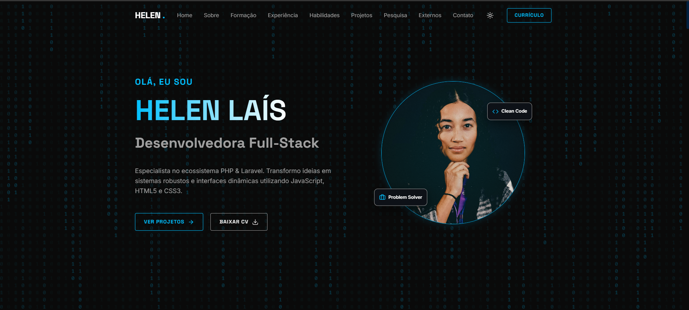
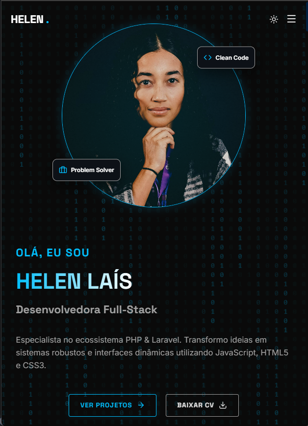
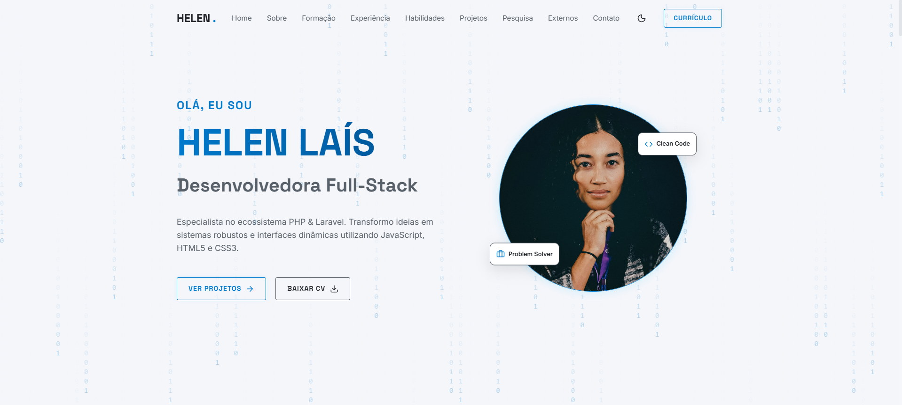
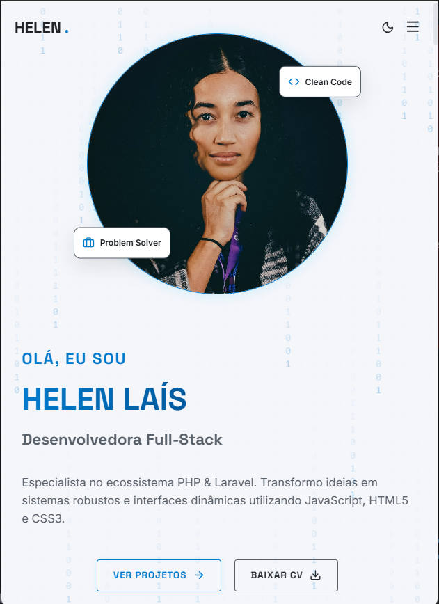

# Portfólio — Helen Laís

<div align="center">
  
Portfólio pessoal com animações, tema claro/escuro, modal de projetos, certificações com visualização ampliada e seções organizadas para destacar experiência, habilidades e projetos.

<br />


[](https://portfolio-helen-nine.vercel.app/)

</div>

---

## 🚀 Demonstração

- 🔗 Acesse: https://portfolio-helen-nine.vercel.app/
- 📸 Preview (Web/Mobile + Claro/Escuro):

| Tema | Desktop | Mobile |
| --- | --- | --- |
| Escuro |  |  |
| Claro |  |  |

---

## � Sobre o Projeto

Este portfólio foi desenvolvido para apresentar de forma clara e visual a minha trajetória como desenvolvedora, reunindo **formação acadêmica**, **certificações**, **experiências**, **habilidades**, **projetos pessoais** e **projetos externos**, com foco em uma interface moderna e responsiva.

Principais objetivos:
- Centralizar informações profissionais em um único lugar
- Melhorar a apresentação com animações e micro-interações
- Facilitar acesso rápido ao currículo e certificados

---

## 🛠️ Tecnologias Utilizadas

- React 19
- Vite
- Framer Motion (animações)
- Lucide React (ícones)
- ESLint

---

## ⚙️ Instalação

Pré-requisitos:
- Node.js (recomendado: LTS)

Passo a passo:
```bash
# Clone o repositório
git clone https://github.com/helenlaisg/Portfolio-Helen.git

# Entre na pasta
cd Portfolio-Helen

# Instale as dependências
npm install

# Execute o projeto
npm run dev
```

Build de produção:
```bash
npm run build
npm run preview
```

---

## 🔑 Configuração

Este projeto não exige variáveis de ambiente para rodar localmente.

---

## 📂 Estrutura de Pastas

```bash
public/
  ├── certificacoes/
  ├── cv/
  ├── screenshots/
  └── videos/
src/
  ├── components/
  ├── App.jsx
  └── index.css
```

---

## 📌 Funcionalidades

- ✔️ Tema claro/escuro
- ✔️ Background estilo Matrix
- ✔️ Modais de projetos (com vídeo e detalhes)
- ✔️ Certificações em cards com hover e modal para visualizar em tamanho maior
- ✔️ Layout responsivo (web e mobile)

## 🧰 Scripts

- `npm run dev`: inicia o servidor de desenvolvimento (Vite)
- `npm run build`: gera build de produção
- `npm run preview`: abre o build gerado
- `npm run lint`: executa o ESLint

---

## 📄 Currículo (PDF)

O botão “Currículo / Baixar CV” aponta para:
- `public/cv/Currículo_HelenLais_Atualizado.pdf`

No site, o link público fica:
- `/cv/Currículo_HelenLais_Atualizado.pdf`

---

## 🏅 Certificações (imagens)

As imagens ficam em:
- `public/certificacoes/`

E são referenciadas no componente:
- `src/components/About.jsx` (array `certifications`)

Exemplo de URL pública:
- `/certificacoes/NOME_DO_ARQUIVO.png`

---

## ☁️ Deploy (Vercel)

Deploy recomendado:
- Framework Preset: Vite
- Build Command: `npm run build`
- Output Directory: `dist`

---

## 🧪 Testes

Este projeto não possui suíte de testes configurada. Para validação, utilize:

```bash
npm run lint
npm run build
```

---

## 📈 Melhorias Futuras

- 🔹 Adicionar testes (unitários e/ou e2e)
- 🔹 Melhorar acessibilidade (atalhos/ARIA)
- 🔹 Otimizar ainda mais o carregamento de mídia (imagens e vídeos)

---

## 🤝 Contribuição

Este é um projeto pessoal, mas sugestões são bem-vindas via Issues/PR.

---

## 👨‍💻 Autora

Feito por **Helen Laís**

- LinkedIn: https://www.linkedin.com/in/helenlaisg/
- GitHub: https://github.com/helenlaisg
- Currículo Lattes: https://lattes.cnpq.br/9677125252408820
